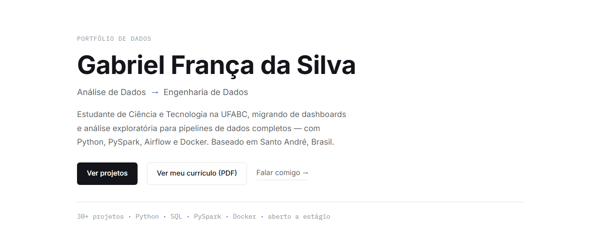
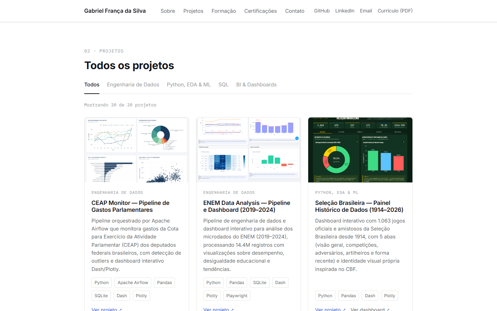
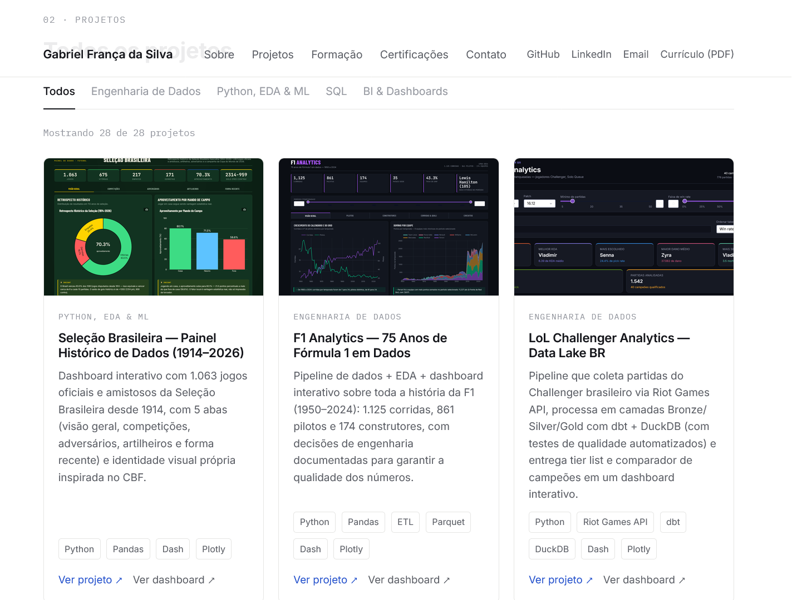

# Portfolio


Portfólio pessoal de **Gabriel França da Silva** — estudante de Ciência e Tecnologia (UFABC),
em transição de análise de dados para engenharia de dados.

**[→ Ver o site ao vivo](https://tayschren.github.io/Portfolio/)**








## Sobre

Este repositório reúne meus projetos de análise, ciência e engenharia de dados, além de
certificações, formação acadêmica e currículo — tudo em um único site estático, sem
frameworks e sem etapa de build.

## Funcionalidades

- 📂 Catálogo de projetos filtrável por categoria (Engenharia de Dados, Python/EDA/ML, SQL, BI & Dashboards)
- 🖼️ Miniaturas e links diretos para repositórios no GitHub e dashboards publicados
- 🎓 Seção de certificações e cursos, e timeline de formação acadêmica
- 📄 Currículo em PDF disponível para download direto no site
- ♿ Acessível: skip link, foco visível, respeita `prefers-reduced-motion`
- 📱 Totalmente responsivo

## Stack

- **HTML5** semântico
- **CSS3** — variáveis nativas, Grid e Flexbox, sem pré-processador
- **JavaScript** vanilla (ES6+) — projetos e certificações renderizados dinamicamente via template literals
- **Google Fonts** (Inter, IBM Plex Mono)
- Hospedado com **GitHub Pages**

## Estrutura

```
├── index.html                            # site inteiro: markup, estilos e script
├── imagens/                              # screenshots do site
├── curriculo-gabriel-franca-silva.pdf    # currículo em PDF
└── README.md
```

## Rodando localmente

Sem dependências, sem instalação, sem build:

```bash
git clone https://github.com/TayschreN/Portfolio.git
cd Portfolio
open index.html   # ou apenas dê duplo clique no arquivo
```

## Arquitetura de dados

Projetos e certificações vivem em dois arrays JavaScript (`PROJECTS` e `CERTIFICATIONS`)
declarados no início da tag `<script>` de `index.html`. A interface (cards, filtros,
contadores) é toda gerada a partir deles — adicionar, remover ou reordenar conteúdo não
exige tocar em HTML ou CSS. O formato esperado de cada campo está documentado em
comentários logo acima de cada array, no próprio código-fonte.

## Contato

- LinkedIn: [linkedin.com/in/gabrielfranca123](https://www.linkedin.com/in/gabrielfranca123/)
- GitHub: [github.com/TayschreN](https://github.com/TayschreN)
- Email: gabriel.fsilva26609@gmail.com

---

Desenvolvido por Gabriel França da Silva.